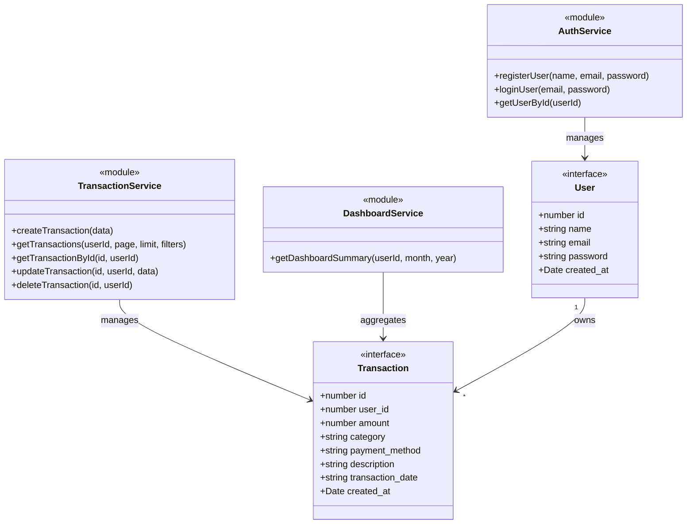

# Class Diagram

```mermaid
classDiagram

class User {
  <<interface>>
  +number id
  +string name
  +string email
  +string password
  +Date created_at
}

class Transaction {
  <<interface>>
  +number id
  +number user_id
  +number amount
  +string category
  +string payment_method
  +string description
  +string transaction_date
  +Date created_at
}

class AuthService {
  <<module>>
  +registerUser(name, email, password)
  +loginUser(email, password)
  +getUserById(userId)
}

class TransactionService {
  <<module>>
  +createTransaction(data)
  +getTransactions(userId, page, limit, filters)
  +getTransactionById(id, userId)
  +updateTransaction(id, userId, data)
  +deleteTransaction(id, userId)
}

class DashboardService {
  <<module>>
  +getDashboardSummary(userId, month, year)
}

AuthService --> User : manages
TransactionService --> Transaction : manages
DashboardService --> Transaction : aggregates
User "1" --> "*" Transaction : owns
```
