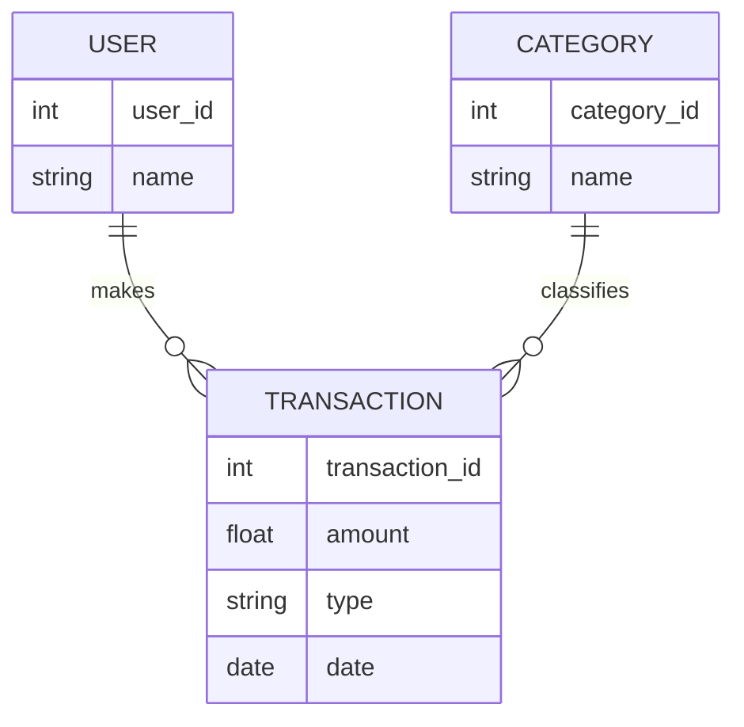

# ER Diagram

```mermaid
erDiagram
    USER ||--o{ TRANSACTION : makes
    CATEGORY ||--o{ TRANSACTION : classifies

    USER {
        int user_id
        string name
    }

    TRANSACTION {
        int transaction_id
        float amount
        string type
        date date
    }

    CATEGORY {
        int category_id
        string name
    }
```
