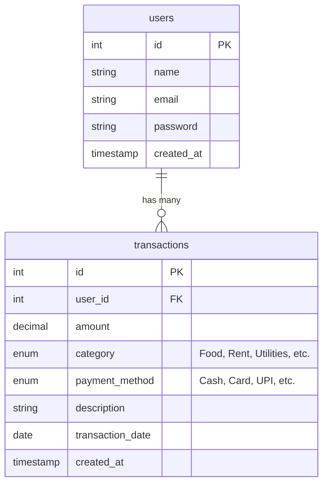

# ER Diagram

<!-- This diagram represents the actual relational database schema defined in MySQL under `backend/src/config/schema.sql`. -->

```mermaid
erDiagram
    users ||--o{ transactions : "has many"

    users {
        int id PK
        string name
        string email
        string password
        timestamp created_at
    }

    transactions {
        int id PK
        int user_id FK
        decimal amount
        enum category "Food, Rent, Utilities, etc."
        enum payment_method "Cash, Card, UPI, etc."
        string description
        date transaction_date
        timestamp created_at
    }

```
