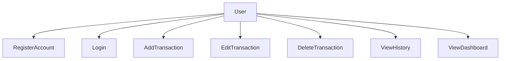

# Use Case Diagram

## Actors
- **User**: The individual tracking their personal finances.

## Use Cases
- Register Account
- Login to Account
- Add a Transaction
- Edit a Transaction
- Delete a Transaction
- View Transaction History
- View Dashboard & Reports

## Mermaid Diagram

